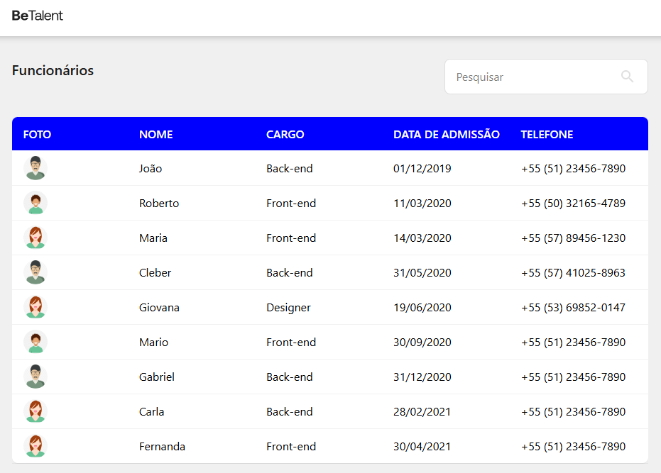
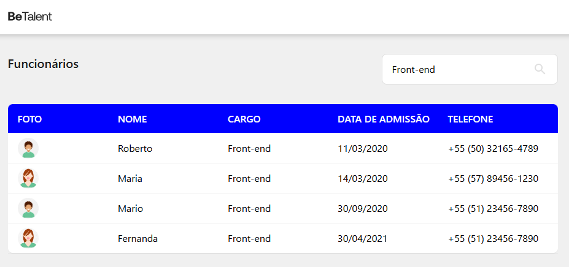
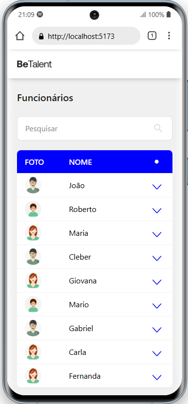
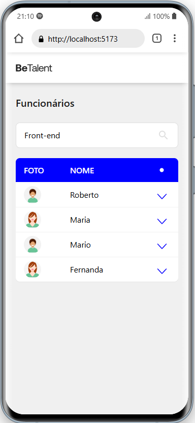
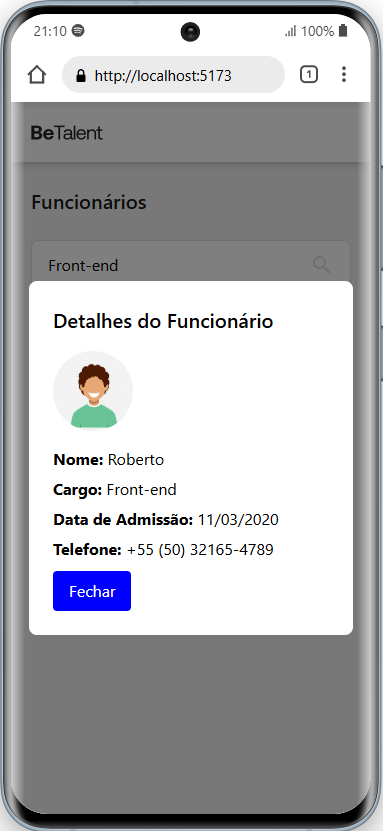

# BeTalent - Lista de Funcionários

## Stack utilizada

**Front-end:** ReactJS, TypeScript, TailwindCSS.

## Funcionalidades

Listagem de funcionários.

Filtrar funcionários por Nome, Profissão e Telefone.

Mobile: Podemos abrir um modal para validar as informações dos funcionários.


## Pré-requisitos

```bash
  node: 23.4.0

  yarn: 1.22.22
```

## Rodando localmente

Clone o projeto

```bash
  git clone https://github.com/NiloMarcos/controlemployess.git
```

Entre no diretório do projeto

```bash
  cd controlemployess
```

Instale as dependências na raiz

```bash
  yarn ou npm i
```

Inicie o backend primeiro, abra um novo terminal e rode o seguinte comando

```bash
  yarn api
```

Inicie o projeto

```bash
  yarn dev
```

Pronto agora podemos utilizar nossa aplicação 🚀

## Fotos da aplicação

## Desktop
<section align="center">
  
  
</section>

## Mobile
<section align="center">
  
  
  
</section>

